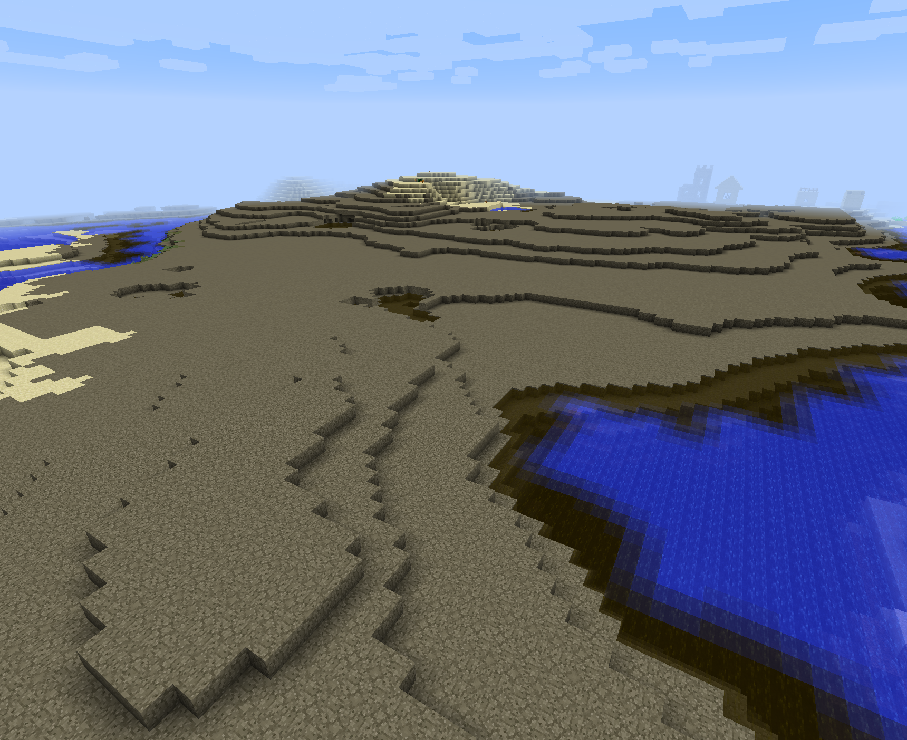

# Auxiliary Biomes

This mod is intended to be used alongside Traverse and Redwoods as a modern replacement for ExtrabiomesXL. While both
of the other mods have clear focuses, Traverse being a Vanilla+ biome mod and Redwoods adding Redwood and Fir trees/biomes,
there were still a few remaining ExtrabiomesXL biomes that did not clearly fit into any category. These were some of
the more silly of the biomes, but also some of the more creative and interesting. Thus, another mod was needed, sort of
a catch-all for all of the remaining biomes that did not really fit into Traverse or Redwoods and were not already in
Vanilla. 

## Features

Auxiliary Biomes adds the following biomes, based on ExtrabiomesXL:

1. Marsh: A swamp-like biome made up of scattered dirt/grass pillars with lots of tall grass. This biome is difficult
   to traverse, but has very interesting terrain.
   
2. Forested Island: A very interesting variant of a forest, mostly made up of ocean but also with massive, cliff mountains
   jutting up out of the water. For reference, this is effectively an Extreme Hills biome but partially underwater, 
   explaining the terrain. In addition, this creates grassy beaches reminiscent of Beta within the biome.

3. White Forest: A very simple biome. It's just a Vanilla forest, but with snow. That's all.

4. Ice Wasteland: Like the Ice Plains biome, but even more barren, and with a surface of Snow blocks instead of dirt
   and grass. Takes on a brilliant white color.

5. Wasteland: A positively ugly biome. Barren and flat with a surface of cracked sand, with sickly water and foliage.
   Looks cool, but why would you want to live here? You tell me.

Note: The Wasteland biomes have a default spawn weight of 5, where the default for all biomes is 10. This is to make 
them more rare, due to their unsightly appearances and punishing environments.

## Licensing

The code is licensed under LGPLv3, and has been written from scratch for newer Minecraft versions.

The Cracked Sand texture has a separate license (CC BY-SA 3.0), as it is derived from 
[ExtrabiomesXL](https://github.com/ExtrabiomesXL/ExtrabiomesXL) as permitted by that license. More can be found in 
[LICENSE-TEXTURES](LICENSE-TEXTURES.md).

## Screenshots

#### Marsh, with no land in sight

*Seed: 477196416031836065 XYZ: 790/80/-750*

#### Forested Island, viewed from an underwater portion

*Seed: 477196416031836065 XYZ: 770/90/-390*

#### White Forest

*Seed: 2856365703918996660 XYZ: 100/90/200*

#### Ice Wasteland

*Seed: 2856365703918996660 XYZ: 540/75/-1300*

#### Wasteland

*Seed: -7727639315657117426 XYZ: -90/80/-500*